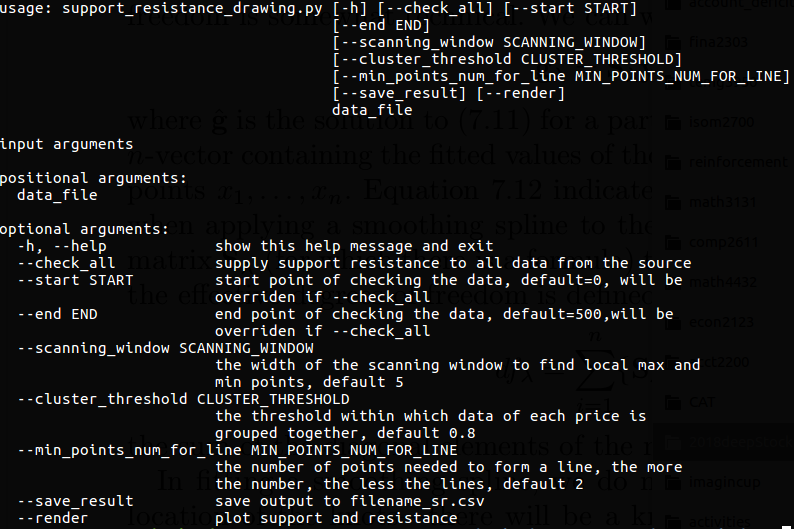
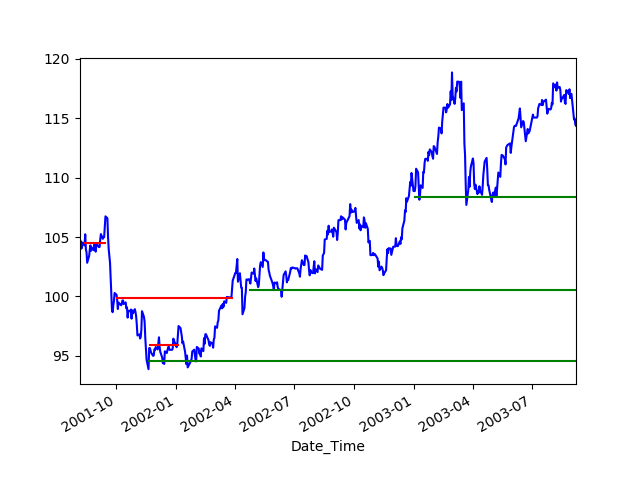

# deepstock
Two submodules exist in this folder.  
In support_resistance_data module, the support and resistant line of a stock could be plotted  
using support_resistance_drawing.py. Command line output is illustrated as:  
  
  
Here, the algorithm scans the range of data specified and attempts to group data points within  
range of each other into groups. A support/resistance line is supported by "min_points_num_for_line".  
Sample output of the support and resistant line  
  
  
A second submodule implements double DQN on 20 years of derivatives data. For simplicity reasons  
actions for each timestep is limited to buy one more unit, and sell all units. A preliminary result  
is indicated in the following pictures  
